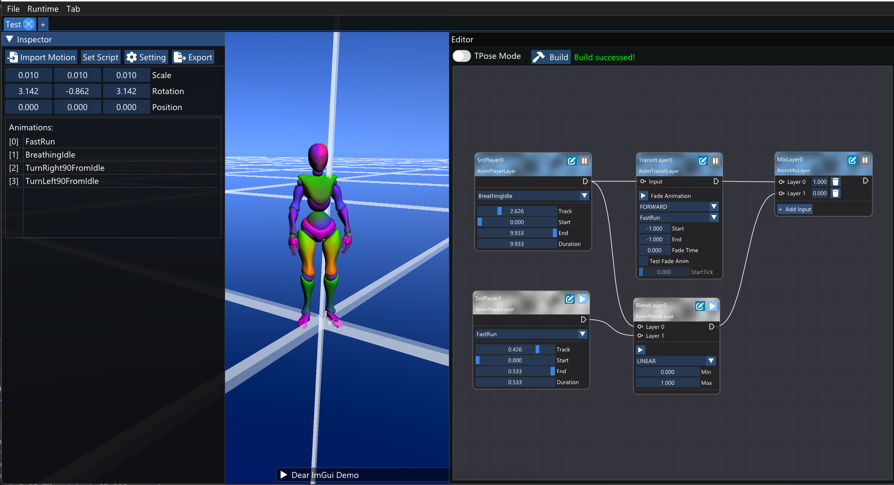

### 1. Animation system by code

This section will describe how to manually use animation system.

#### 1.1. Resources loading

***NOTE: It is highly recommended to use AnimatorEditor to deal with animation resources, do not manually load resources if you don't sure what are you doing.***

+ `AnimModel`:  class refers to a resource on file system
  
  + To make a game object from model file (.fbx, *.dae,...):
    
    ```cpp
    auto gameObject = resource::Load<AnimModel>(filePath)->MakeGameObject();
    scene->AddObject(gameObject);
    ```

+ `AnimMotion`: class refers to a resource on file system
  
  + To load motion from model file (.fbx, *.dae,...):
    
    ```cpp
    auto motion = resource::Load<AnimMotion>(filePath); 
    ```
  
  + To add `AnimMotion` to `AnimModel`:
    
    ```cpp
    auto animModel = resource::Load<AnimModel>(modelFilePath);
    auto motion = resource::Load<AnimMotion>(motionFilePath);
    
    // this is a costly function in the first time you load the animation due to it need to recalculate AABB of this model that match the motion
    // this animation may have ID of 0
    auto animation = animModel->AddAnimation(motion);
    assert(animation == animModel->GetAnimation(0));
    
    // there are 2 other functions to load animation in separate threads
    // this animationId must be 1
    ID animationId = animModel->PlaceHolderAnimation(motion);
    assert(animationId == 1);
    
    struct Params
    {
        Resource<AnimMotion> motion;
        Resource<AnimModel> animModel;
        ID animationId;
    };
    
    Task task = {};
    task.Params() = new Params(motion, animModel, animationId);
    task.Entry() = [](void* p)
    {
        // unpack 3 params above
        TASK_SYSTEM_UNPACK_PARAMS_3(p, Params, motion, animModel, animationId);
    
        animModel->LoadAnimation(animationId, motion);
    
        delete p;
    };
    
    TaskSystem::Submit(task);
    
    auto gameObject = animModel->MakeGameObject();
    scene->AddObject(gameObject);
    ```

#### 1.2. Animation layers

+ `AnimatorSkeletalArray`: component to deal process animation (as it name, the hierarchy of animation model will be represented as an array), it contains many `AnimLayer` from that the animation will be passed through one by one layer and be played, mixed, jointed, faded,...
  
  + Usage
    
    ```cpp
    auto gameObject = animModel->MakeGameObject();
    
    // a default AnimatorSkeletalArray will contain 2 AnimLayer of AnimPlayerLayer and AnimTransitLayer
    auto animator = gameObject->GetComponent<AnimatorSkeletalArray>();
    
    // =))) fuck OOP
    auto& layers = animator->m_animLayers;
    ```

+ `AnimPlayerLayer`: layer to play a single animation
  
  + Usage
    
    ```cpp
    auto playerLayer = layers[0];
    playerLayer->SetAnimation(animation);
    
    // play animation from sec 0 to sec 10, all time in the system APIs present in sec
    playerLayer->SetAnimation(animation, 0.0f, 10.0f);
    
    // set the animation duration
    playerLayer->SetDuration(20.0f);
    ```

+ `AnimTransitLayer`: layer to transit from one animation to another
  
  + This layer will require  1 input layer.
  
  + `FadeTo()`: this funtion will only support to fade the animation to another if the input layer is an instance of `AnimPlayerLayer` class. In the case the input is not kind of `AnimPlayerLayer`, after calling `FadeTo()`, you need to manually set the animation of source `AnimPlayerLayer` layer. This is the same for `QueuedFadeTo()`.
  
  + `AnimTransitLayer::TransitDirection::FORWARD`: forward fade to the destination animation (the input animation of `FadeTo()` function). Destination animation will be played right after `FadeTo()` and the blend factor of destination animation will start from 0 and go to 1. In the case of the input is not type of `AnimPlayerLayer`, you need to manually set the animation of source `AnimPlayerLayer` at the right below of `FadeTo()` to take the effect.
  
  + `AnimTransitLayer::TransitDirection::BACKWARD`: source animation will be continued to play during the `fadeTime` and the blend factor of source animation will start from 1 and down to 0.  In the case of the input is not type of `AnimPlayerLayer`, you need to manually set the animation of source `AnimPlayerLayer` after the `fadeTime` ended to gain the effect of transition. The timing process can be easily done with `Action` classes.
  
  + Usage
    
    ```cpp
    auto transitLayer = layers[1];
    auto fadeTime = 0.3f; // in sec
    auto startTime = 0.0f;
    auto endTime = 10.0f;
    
    transitLayer->FadeTo(
        AnimTransitLayer::TransitDirection::FORWARD,
        fadeTime,
        animation,
        startTime,
        endTime
    );
    // if transitLayer->input is not an instance of AnimPlayerLayer
    srcPlayerLayer->SetAnimation(animation);
    
    transitLayer->FadeTo(
        AnimTransitLayer::TransitDirection::BACKWARD,
        fadeTime,
        animation,
        startTime,
        endTime
    );
    // if transitLayer->input is not an instance of AnimPlayerLayer
    actionExecution->RunAction(
        ActionSequence::New(
            {
                ActionDelay::New(fadeTime),
                ActionCallback::New([&]()
                    {
                        srcPlayerLayer->SetAnimation(animation);
                    }
                )
            }
        )
    );
    ```

+ `AnimBlendLayer`: layer to blend 2 different layers
  
  + This layer will requires 2 input layers and a blend factor control function.
  
  + Usage: <u><mark>***TODO***</mark></u>

+ `AnimJointLayer`: layer to joint many different layers.
  
  + The case for this layer is when you need to play each part of body with different animation.
  
  + Usage: ***<u><mark>TODO</mark></u>***

+ `AnimMixLayer`: layer to mix many different layers.
  
  - The case for this layer is mainly when you need to switch between animation layers path.
  
  - Usage: ***<u><mark>TODO</mark></u>***

### 

### 2. AnimatorEditor

<div>
<figure>
  
  <figcaption>Image 1: AnimatorEditor UI Overview</figcaption>
</figure>
</div>

Press `ESC` to switch to free camera and `W,A,S,D` to navigate around.

+ The right panel is the zone to edit `AnimLayer` node graph, each node matchs to one type of `AnimLayer`, the name of `AnimLayer` class will be showed under the node name. Edit the nodes then press the `Build` button to flush the graph to `AnimatorSkeletalArray`.

+ After edit the animator, press `Export` button to export data. The exported data contains 2 files. One is a game object file in the format of \*.json (or \*.bin) which can be used to load into a scene. One is a C++ header file which can be used to interact with the graph. See `SampleProjects/Test/MyTestScript.cpp` for more detail sample. 

+ Demo link: [build.rar - Google Drive](https://drive.google.com/file/d/1gSRLiGM9tzvUcLwnDRR5iiJ4yyHKuhHR/view?usp=sharing). Press `ESC` then `V` to start move the character.
